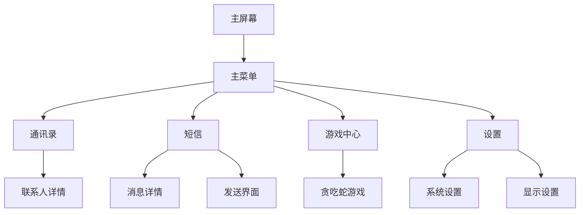

# Nokia复古按键机UI网页应用需求文档

## 1. 产品概述

一个完全模仿Nokia经典按键机系统UI的离线网页应用，专为安卓手机设计，通过键盘导航操作而非触摸交互。

* 重现Nokia按键机的经典用户体验，包括界面风格、操作逻辑和视觉效果，让用户体验到怀旧的手机操作感受。

* 面向怀旧用户群体和复古电子产品爱好者，提供独特的非触摸式移动端体验。

## 2. 核心功能

### 2.1 用户角色

本应用无需用户角色区分，所有用户均可直接使用全部功能。

### 2.2 功能模块

我们的Nokia复古按键机应用包含以下主要页面：

1. **主屏幕**：经典Nokia开机界面、时间显示、信号强度、电池状态
2. **主菜单**：九宫格菜单布局、图标导航、选中高亮效果
3. **通讯录**：联系人列表、字母索引、详情查看
4. **短信**：消息列表、消息详情、发送界面
5. **游戏中心**：内置经典游戏（贪吃蛇等）、游戏选择菜单
6. **设置**：系统设置选项、铃声设置、显示设置

### 2.3 页面详情

| 页面名称 | 模块名称   | 功能描述                 |
| ---- | ------ | -------------------- |
| 主屏幕  | 状态栏    | 显示当前时间、信号强度图标、电池电量图标 |
| 主屏幕  | 运营商信息  | 显示虚拟运营商名称和网络状态       |
| 主屏幕  | 快捷操作提示 | 显示按键操作提示文字           |
| 主菜单  | 九宫格布局  | 3x3网格排列的功能图标，支持方向键导航 |
| 主菜单  | 图标高亮   | 当前选中项的视觉反馈效果         |
| 主菜单  | 功能标签   | 每个图标下方显示功能名称         |
| 通讯录  | 联系人列表  | 显示预设联系人信息，支持上下滚动浏览   |
| 通讯录  | 字母索引   | 快速跳转到指定字母开头的联系人      |
| 通讯录  | 联系人详情  | 显示姓名、电话号码等详细信息       |
| 短信   | 消息列表   | 显示对话列表，包含发送者和最新消息预览  |
| 短信   | 消息详情   | 显示完整对话记录，支持滚动查看      |
| 短信   | 发送界面   | T9输入法模拟，文本编辑和发送功能    |
| 游戏中心 | 游戏列表   | 显示可用游戏选项（贪吃蛇、俄罗斯方块等） |
| 游戏中心 | 贪吃蛇游戏  | 经典贪吃蛇游戏逻辑，方向键控制，分数统计 |
| 游戏中心 | 游戏设置   | 难度选择、音效开关等选项         |
| 设置   | 系统设置   | 铃声选择、震动设置、背光时间等选项    |
| 设置   | 显示设置   | 对比度调节、字体大小等显示相关设置    |
| 设置   | 关于信息   | 显示虚拟设备信息和版本号         |

## 3. 核心流程

用户通过物理键盘或虚拟按键进行导航操作：

1. 开机进入主屏幕，显示时间和状态信息
2. 按菜单键进入主菜单，使用方向键在九宫格中导航
3. 按确认键进入选中的功能模块
4. 在各功能模块内使用方向键浏览内容，返回键退回上级菜单
5. 在游戏模块中，方向键控制游戏角色移动
6. 在设置模块中，方向键选择选项，确认键修改设置

## 4. 用户界面设计

### 4.1 设计风格

* **主色调**：经典Nokia绿色背景 (#9BBB58)，黑色文字 (#000000)

* **次要颜色**：深绿色选中高亮 (#7A9B42)，灰色边框 (#666666)

* **按钮样式**：像素化矩形按钮，无圆角，简单边框

* **字体**：等宽像素字体，12px-16px大小，模拟LCD显示效果

* **布局风格**：网格化布局，居中对齐，简洁的线条分割

* **图标风格**：黑白像素图标，简单几何形状，8x8或16x16像素

### 4.2 页面设计概览

| 页面名称 | 模块名称  | UI元素                      |
| ---- | ----- | ------------------------- |
| 主屏幕  | 状态栏   | 顶部固定区域，黑色文字，绿色背景，时间居中显示   |
| 主屏幕  | 运营商信息 | 屏幕中央，较大字体显示"NOKIA"或虚拟运营商名 |
| 主菜单  | 九宫格   | 3x3网格布局，每格包含黑白图标和文字标签     |
| 通讯录  | 列表项   | 单行显示，左对齐姓名，右对齐电话号码        |
| 短信   | 对话气泡  | 简单矩形框，发送和接收消息用不同对齐方式      |
| 游戏中心 | 游戏界面  | 黑色边框，绿色游戏区域，底部显示分数        |
| 设置   | 选项列表  | 左侧选项名称，右侧当前值或开关状态         |

### 4.3 响应性设计

* 专为移动端设计，固定竖屏方向

* 允许触摸交互，仅支持键盘导航

* 适配不同安卓手机屏幕尺寸，保持经典比例

